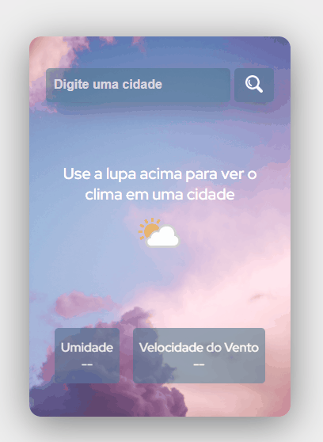

# Weather Conditions APP

APP that shows the current weather conditions in any city using the [Weather API](https://www.weatherapi.com/).

## Table of Contents

- [Objective](#objective)
- [Link](#link)
- [Screenshot](#screenshot)
- [Tools](#tools)
- [Author](#author)

## Objective

The objective of this project was the development of an APP that shows the current weather conditions in a city of the user's choice, a web application using the [Weather API](https://www.weatherapi.com/) to fetch the data. 
The user type the name of the city and the page gives the information about temperature, humidity and wind speed.

## Link

This is the link to see the project:  
https://camilakataa.github.io/weather-condition-app/

## Screenshot

## Tools

- HTML
- CSS Styling
- JavaScript
- [Weather API](https://www.weatherapi.com/).

## Author

- LinkedIn - [Camila Katayama](https://www.linkedin.com/in/camila-katayama-ab1a42153/)
- GitHub - [@camilakataa](https://github.com/camilakataa)

